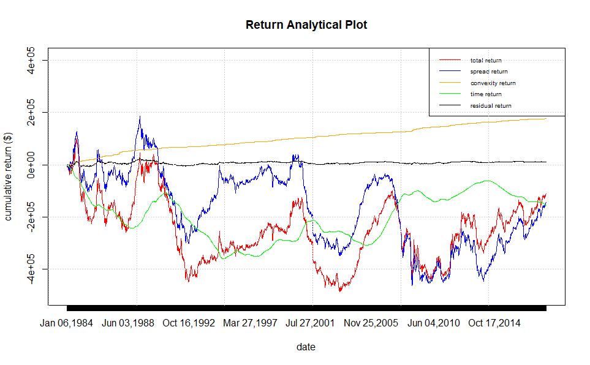
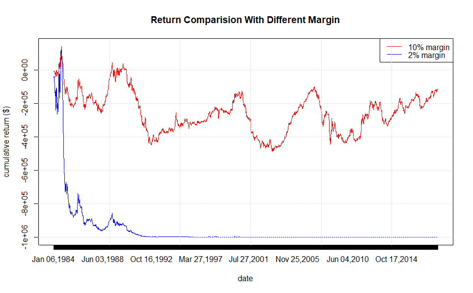

$$\text{Cohort 2 - Group 7 (Huanyu Liu, Hyeuk Jung, Jiaqi Li, Xichen Luo)}$$

# Yield Curve Spread Trades Report

## Executive Summary

In this project, the stretegy at the beginning is randomly chose. To analyze the viability of the strategy, our group calculate and plot the cumulative return. If the return is positive, which means the strategy would bring profit, then we would conclude that the strategy is effective. If the return is negative, which means the strategy would cause the loss of profit, then we would conclude that the strategy chosen is not effective and should be rejected, and another strategy should be applied. 

The strategy we choose is the 10yr - 2yr U.S. Treasury flattener strategy, which is to short 2yr U.S. Treasury bonds and long 10 yr U.S. Treasury bonds. The report is to analyze the effectiveness of the flattener strategy.

## Introduction

In the report, the discussion mainly describes the calculation process on the first week. On the last day of the first week, close the position, and immediately rebalance the new 2yr Treasury bonds and 10yr Treasury bonds to maintain the DV01-neutral position and calculate the new capital as the initial capital as the new week. So the calculation after the first week would be restarted and follow the same process as the first week. 

## Discussion

### On Dec 30, 1983:

a. The yields of 2yr U.S. Treasury bond and 10yr U.S. Treasury bond are given:
$\\$
$\\$
The yield of 2yr U.S. Treasury bond:
$$r_{2}=$$
The yield of 10yr U.S. Treasury bond:
$$r_{10}=$$
b. The starting prices of 2yr U.S. Treasury bond and 10yr U.S. Treasury bond:
$\\$
$\\$
The price of 2yr U.S. Treasury bond:
$$P_{2} = \frac{100}{e^{2\times r_2}}=80.98$$
The price of 10yr U.S. Treasury bond:
$$P_{10} = \frac{100}{e^{10\times r_{10}}}=31.21\\$$
c. Set up the DV01-neutral yield curve spread trade:
$\\$
$\\$
Since both 2yr Treasury bond and 10yr Treasury bond are all zero-coupon bonds, then their Macaulay durations equal to their maturity, which should be:
$$D_2=T_2=2$$
$$D_{10}=T_{10}=10$$
The calculation of DV01:
$\\$
$\\$
(i). For the 2yr U.S. Treasury bond:
$$D_2^*=\frac{D_2} {e^{2\times r_2}}$$
$$DV01_2=D_2^*\times P_2\\$$
(ii). For the 10yr U.S. Treasury bond:
$$D_{10}^*=\frac{D_{10}} {e^{10\times r_{10}}}$$
$$DV01_{10}=D_{10}^*\times P_{10}\\$$
Build the DV01-neutral yield curve spread trade equition:
$$DV01_{2}\times \text{x}_{2}=DV01_2\times \text{y}_{10}\\$$
$$|P_{2}\times \text{x}_{2}|-|P_{10}\times \text{y}_{10}|=\frac{\text{Initial Capital}}{\text{Margin Requirement}}$$
Note that the initial capitalis $1 million dollars:
$$\text{Initial Capital}=1,000,000\\$$
The Margin requirement is 10%:
$$\text{Margin Requirement}=10\%$$
Solve the equitions: 
$$\text{x}_{2}=$$
$$\text{x}_{10}=$$
In that case, on Dec 30, 1983, short $\text{x}_{2}$ shares of 2yr Treasury bonds and long $\text{x}_{10}$ shares of 10yr Treasury bonds.

### One week after Dec 30, 1983, when it is Jan 5, 1984:

a. The calculation of the new prices of the bonds:
$\\$
$\\$
The calculation of yields would is based on the Nelson-Siegel-Svensson (NSS) model:
$\\$
$\\$
$$r_t = \beta_0+\beta_1\times\frac{1-e^{-t_1}}{t_1}+\beta_2\times[\frac{1-e^{-t_1}}{t_1}-e^{-t_1}]+\beta_3\times[\frac{1-e^{-t_2}}{t_2}-e^{-t_2}]$$
with $t_j=t/\tau_j$, and where $\beta_k$ and $\tau_j$ are based on the daily estimation posted on the file, the daily U.S. Treasury yield curve.
$\\$
$\\$
(i). For the 2yr U.S. Treasury bond:
$\\$
$\\$
$t=2-\frac{7}{365}$, $\tau_1$, $\tau_2$, $\beta_1$, $\beta_2$, and $\beta_3$ are from the estimation on Jan 5, 1984. Solve the NSS model, get the yield of 2yr U.S. Treasury bond and denote as: 
$$r_{2}^{'}$$
(ii). For the 10yr U.S. Treasury bond:
$\\$
$\\$
$t=10-\frac{7}{365}$, $\tau_1$, $\tau_2$, $\beta_1$, $\beta_2$, and $\beta_3$ are from the estimation on Jan 5, 1984. Solve the NSS model, get the yield of 10yr U.S. Treasury bond and denote as: 
$$r_{10}^{'}$$
Hence, the new prices of 2yr U.S. Treasury bond and 10yr U.S. Treasury bond:
$$P_{2}^{'}= \frac{100}{e^{(2-\frac{7}{365})\times r_2^{'}}}=81.27$$
$$P_{10}^{'} = \frac{100}{e^{(10-\frac{7}{365})\times r_{10}^{'}}}=31.38$$
b. The calculation of interest earning or paid:
$\\$
$\\$
The calculation of interest rate is based on the Nelson-Siegel-Svensson (NSS) model:
$\\$
$\\$
Here we assume that the interest rate is the one-week Treasury yield and it is calculated based on the parameters given on Dec 30, 1983. 
$\\$
Then $t=\frac{7}{365}$, $\tau_1$, $\tau_2$, $\beta_1$, $\beta_2$, and $\beta_3$ are from the estimation on Dec 30, 1983. Solve the NSS model, get the interest rate, and denote as:
$$r_{int}$$
The interest earned or paid during the past week is:
$$\text{Interest} = (e^{\frac{7}{365}\times r_{int}}-1)\times \text{Initial Capital}$$
c. Close out the position:
$$\text{End Capital}=P_{2}^{'}\times \text{x}_{2}+P_{10}^{'}\times \text{y}_{10}+\text{Interest}+\text{Initial Capital}$$

### The Formula of Returns Calculation

#### Cumulative Return

The return for each week:
$$\Delta \text{Return}=\text{End Capital}-\text{Initial Capital}$$
$$\text{Cumulative Return}=\sum_{i=1}^{1801}\Delta\text{Return}_i$$

#### Spread Return 

the return due to changes in the yield spread using DV01.
$\\$
$\\$
Assume that the price does change during this week. The spread return earned from 2y Treasury bond is:
$$\Delta\text{Spread Return}_2=-(\text{x}_2\times P_2)\times D_2^*\times\Delta r_2=-(\text{x}_2\times P_2)\times D_2^*\times(r_2^{''}-r_2)$$
The yield of 2y Treasury bond is calculated based on the NSS model, and we have $t=2$, $\tau_1$, $\tau_2$, $\beta_1$, $\beta_2$, and $\beta_3$ are from the estimation on Jan 5, 1984. Denote as:
$$r_2^{''}$$
The spread return earned from 10y Treasury bond is:
$$\Delta\text{Spread Return}_{10}=-(\text{x}_{10}\times P_{10})\times D_{10}^*\times\Delta r_{10}=-(\text{x}_{10}\times P_{10})\times D_{10}^*\times(r_{10}^{''}-r_{10})$$
The yield of 2y Treasury bond is calculated based on the NSS model, and we have $t=10$, $\tau_1$, $\tau_2$, $\beta_1$, $\beta_2$, and $\beta_3$ are from the estimation on Jan 5, 1984. Denote as:
$$r_{10}^{''}$$
The spread return for this week is:
$$\Delta\text{Spread Return}=\Delta\text{Spread Return}_2+\Delta\text{Spread Return}_{10}$$
The cumulative spread return:
$$\text{Cumulative Spread Return}=\sum_{i=1}^{1801}\Delta\text{Spread Return}_i$$

#### Convexity Return

The return due to changes in the yield from convexity.
$\\$
$\\$
The convexity of 2y bond is:
$$\gamma_2=\frac{2\times(2+1)}{(1+r_2)^2}$$
The convexity of 10y bond is:
$$\gamma_{10}=\frac{10\times(10+1)}{(1+r_{10})^2}$$
The convexity return from 2y Treasury bond is:
$$\Delta\text{Convexity Return}_{2}=\frac{1}{2}(\text{x}_{2}P_{2})\times\gamma_{2}\times(\Delta r
_{2})^2=\frac{1}{2}(\text{x}_2P_{2})\times\gamma_2\times(r_2^{''}-r_2)^2$$
The convexity return from 10y Treasury bond is:
$$\Delta\text{Convexity Return}_{10}=\frac{1}{2}(\text{x}_{10}P_{10})\times\gamma_{10}\times(\Delta r
_{10})^2
=\frac{1}{2}(\text{x}_{10}P_{10})\times\gamma_{10}\times(r_{10}^{''}-r_{10})^2$$
The convexity return for this week is:
$$\Delta\text{Convexity Return}=\Delta\text{Convexity Return}_2+\Delta\text{Convexity Return}_{10}$$
The culmulative convexity return:
$$\text{Cumulative Convexity Return}=\sum_{i=1}^{1801}\Delta\text{Convexity Return}_i$$

#### Time Return

The return due to the passage of time and interest on the cash position.
$\\$
$\\$
Here we assume that the yield during this week is flat, which means the yield on Jan 5, 1984 is the same as the yield on Dec 30, 1983,  and the price is changed only because of the change of maturity.
$\\$
$\\$
The yield of 2y Treasury bond is calculated based on the NSS model, and we have $t=2-\frac{7}{365}$, $\tau_1$, $\tau_2$, $\beta_1$, $\beta_2$, and $\beta_3$ are from the estimation on Dec 30, 1983. Denote as:
$$r_2^{'''}$$
The price of 2y Treasury bond:
$$P_{2}^{'''} = \frac{100}{e^{(1-\frac{7}{365})\times r_2^{'''}}}$$
The time return from 2y Treasury bond:
$$\Delta\text{Time Return}_2 = \Delta P_2\times\text{x}_2=({P_{2}^{'''}-P_2})\times\text{x}_2$$
The yield of 10y Treasury bond is calculated based on the NSS model, and we have $t=10-\frac{7}{365}$, $\tau_1$, $\tau_2$, $\beta_1$, $\beta_2$, and $\beta_3$ are from the estimation on Dec 30, 1983. Denote as:
$$r_{10}^{'''}$$
The price of 10y Treasury bond:
$$P_{10}^{'''} = \frac{100}{e^{(10-\frac{7}{365})\times r_{10}^{'''}}}$$
The time return from 10y Treasury bond:
$$\Delta\text{Time Return}_{10} =  \Delta P_{10}\times\text{x}_{10}=({P_{10}^{'''}-P_{10}})\times\text{x}_{10}$$
$$\Delta\text{Time Return}=\Delta\text{Time Return}_2+\Delta\text{Time Return}_{10}+\text{Interest}$$
The cumulative time return:
$$\text{Cumulative Time Return}=\sum_{i=1}^{1801}\Delta\text{Time Return}_i$$

#### Residual

The difference between the total return and the sum of the spread return, convexity return, and time return.
$$\Delta\text{Residual Return}=\Delta\text{Cumulative Return}-(\Delta\text{Spread Return}+\Delta\text{Convexity Return}+\Delta\text{Time Return})$$
The cumulative residual return:
$$\text{Cumulative Residual Return}=\sum_{i=1}^{1801}\Delta\text{Residual Return}_i$$

\newpage

## Conclusion

1. The plot of cumulative return, spread return, convexity return, time return and residual.
$\\$
$\\$

$\\$
$\\$
Using the flatterner strategy, by plotting the result, we conclude that the cumulative return, which is the red line in the plot, is below the 0 level. It means that the application of flatterner strategy cause the loss, which is not effective and should be rejected. The steepener strategy should be used to earn profit.

\newpage

2. The plot of the cumulative total return of the 2% margin requirement and the 10% margin requirement
$\\$
$\\$

$\\$
$\\$
When the margin requirement is 2%, the capital run out in 1993. The reason is that the less the margin requirement is, the larger the leverage is. For the 10% margin requirement, the leverage is 10 times. For the 2% margin requirement, the leverage is 50% times. When the leverage is too large, the volatility will also become heady. In that case, even though the portfolio only drifts down a little, the loss could cause the loss of the most part of the capital, even the loss of the whole capital.