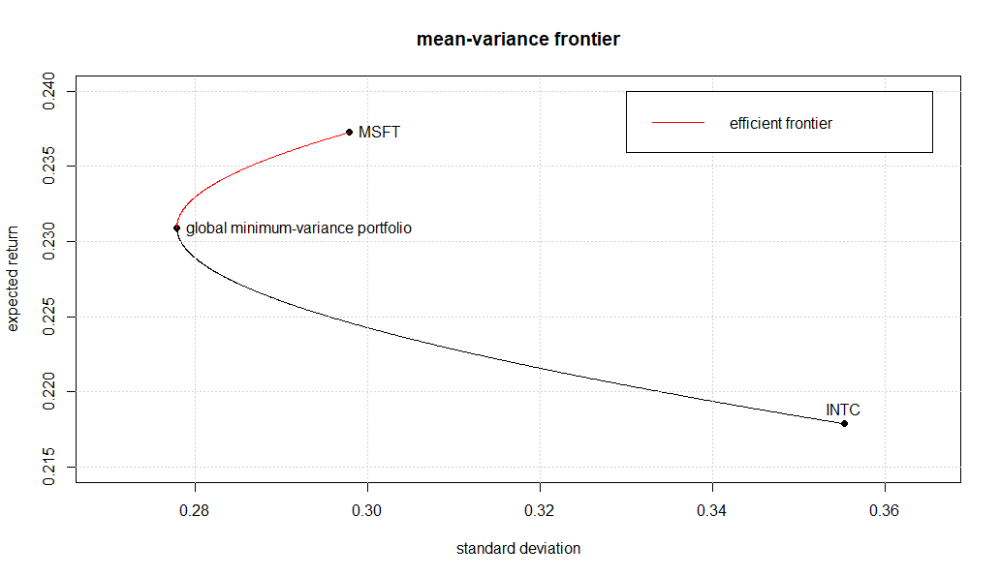

$$\text{Cohort 2 - Group 7 (Huanyu Liu, Hyeuk Jung, Jiaqi Li, Xichen Luo)}$$

## Problem 1. The mean and volatility of weekly returns

The calculation of weekly returns is based on the adjusted price, which considers the dividends effect.
$$\text{r}=\frac{\text{p}_1-\text{p}_0}{\text{p}_0}$$
Note that in the formula above, $\text{r}$ is the weekly return, $\text{p}_1$ is the adjusted price of the last day of the week, and $\text{p}_0$ is the adjusted price of the first day of the week.

The mean of weekly returns:
$$\mu=\frac{\sum{\text{r}_i}}{n}$$
Note that in the formula above, $\mu$ is the mean of weekly returns, $\text{r}_i$ is the weekly returns, and $\text{n}$ is the number of weeks from 12/29/1989 to 9/28/2018.

#### The mean of Intel weekly returns is:
$$\text{r}_\text{INTC}=0.42\%$$

#### The mean of Microsoft weekly returns is:
$$\text{r}_\text{MSFT}=0.46\%$$

The standard deviation of weekly returns:
$$\sigma=\sqrt\frac{\sum{{(\text{r}_i}-\mu)}^2}{n}$$
Note that in the formula above, $\sigma$ is the standard deviation of weekly returns.

#### The standard deviation of Intel weekly returns is:
$$\sigma_\text{INTC}=4.93\%$$

#### The standard deviation of Microsoft weekly returns is:
$$\sigma_\text{MSFT}=4.13\%$$

The annualized mean of weekly returns:
$$\mu_a=\mu\times52$$
Note that in the formula above, $\mu_a$ is the annualized mean of weekly returns.

#### The annualized mean of Intel weekly returns is:
$$\mu_\text{a.INTC}=21.79\%$$

#### The annualized mean of Microsoft weekly returns is:
$$\mu_\text{a.MSFT}=23.73\%$$

The annualized volatility:
$$\sigma_a=\sigma\times\sqrt{52}$$
Note that in the formula above, $\sigma_a$ is the annualized volatility of weekly returns.

#### The annualized volatility of Intel weekly returns is:
$$\sigma_\text{a.INTC}=35.53\%$$

#### The annualized volatility of Microsoft weekly returns is:
$$\sigma_\text{a.MSFT}=29.79\%$$

## Problem 2. Portfolio allocation

Calculate the portfolio weight that maximizes utility:
$$w_t^\star=\frac{E_t(R_{r,t+1})-R_{f,t}}{A\times V_t(R_{r,t+1})}$$
Note that $A$ is 4, $R_{f,t}$ is 1%, $E_t(R_{r,t+1}$ is the annualized mean of weekly returns, and $V_t(R_{r,t+1}$ is the quadratic annualized volatility of weekly returns.

#### The Intel stock weight in the portfolio that maximizes utility:
$$w_{t.INTC}^\star=41.18\%$$

#### In that case, for the portfolio that maximizes the utility, allocate 41.18% capital on Intel stock and 59.82% ( = 1 - 41.18% ) capital on risk-free asset.

#### The Microsoft stock weight in the portfolio that maximizes utility:
$$w_{t.MSFT}^\star=64.02\%$$

#### In that case, for the portfolio that maximizes the utility, allocate 64.02% capital on Microsoft stock and 35.98% ( = 1 - 64.02% ) capital on risk-free asset.

\newpage

## Problem 3. Allocation strategy based on utility

The portfolio weight that maximizes utility is calculated above. Then calculate the utility using the portfolio weight calculated.
$$U(R_{t+1},w_t)=w_t(E_t(R_{r,t+1})-R_{f,t})+R_{f,t}-\frac{A}{2}\times w^2_t V_t(R_{r,t+1})$$

#### The utility allocating on Intel stock:
$$U_{INTC}=0.053$$

#### The utility allocating on Microsoft stock:
$$U_{MSFT}=0.083$$

#### The utility allocating on Microsoft stock is larger than the utility allocating on Intel stock, in that case, choose to allocate 64.02% capital on Microsoft stock and 35.98% ( = 1 - 64.02% ) capital on risk-free asset.

## Problem 4. Mean-variance frontier for Intel-Microsoft combination

The plot of efficient frontier for Intel-Microsoft combination
$\\$
$\\$

#### The red line in the plot is the efficient frontier and the minimum-variance portfolio is on the dot marked as "global minimum-variance portfolio". Because this dot is the lowest standard deviation (also the lowest variance) that the portfolio could reach.