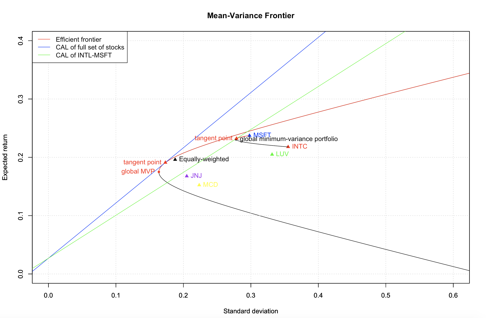

$$\text{Cohort 2 - Group 7 (Huanyu Liu, Hyeuk Jung, Jiaqi Li, Xichen Luo)}$$

## The plot of the mean-variance frontier is shown below:
$\\$

## Problem 1. Mean-variance Frontier

The minimum-variance is the vertex of the mean-variance frontier and the effecient frontiers is the red line of the mean-variance frontier. Adding assets shifts the portfolio frontier to the left, which reduces the variance that can be achieved for a given expected return.

## Problem 2. Tangent Portfolio Comparison

The Sharp ratio in the Intel-Microsoft case is less than that in the full set of stocks case, because diversification reduces risks for a given expected return. In that case, for a given standard deviation, the expected return in the full set of stocks case is larger than that in the Intel-Microsoft case.

#### In the full set of stocks case 

The return for the tangent point is 
$$E(R)=0.189$$
The standard deviation for the tangent point is 
$$\text{sd}=0.171$$
The weight for each risk asset in the portfolio is:
$$W_\text{INTC}=0.0753$$
$$W_\text{MSFT}=0.2573$$
$$W_\text{LUV}=0.1168$$
$$W_\text{MCD}=0.1768$$
$$W_\text{JNJ}=0.3738$$

#### In the Intel-Microsoft case  

The return for the tangent point is 
$$E(R)=0.232$$
The standard deviation for the tangent point is 
$$\text{sd}=0.279$$
The weight for each risk asset in the portfolio is:
$$W_\text{INTC}=0.259$$
$$W_\text{MSFT}=0.741$$

## Problem 3. Optimal Mix of Assets

Knowing the risk aversion is A=5, to maximize utility:
$$U(R,w)=w(E(R)-R_f)+R_f-\frac{A}{2}w^2V(R_{t+1})$$
$$w^*=argmax_wU(R,w)$$
Take the first derivative to calculate the weight of portfolio that maximize the utility:
$$(E(R)-R_f)-AwV(R_{t+1})=0$$
$$w=\frac{1}{A}\frac{(E(R)-R_f)}{V(R_{t+1})}$$
In that case, maximizing the utility is the same as maximizing the Sharp ratio. The optimal mix of assets is also the tangent portfolio, which is shown in the plot.
$$w=1.092$$
It means that to maximize the utility, short 0.092 risk free asset and long 1.092 risk assets.