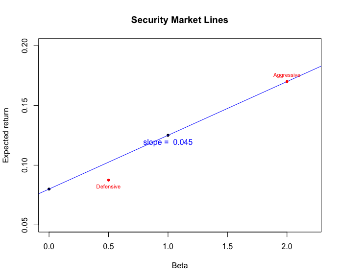

$$\text{Cohort 2 - Group 7 (Huanyu Liu, Hyeuk Jung, Jiaqi Li, Xichen Luo)}$$

## Problem 1

1. 
a. According to the CAPM: 
$$E(R_i)=R_f + \beta(E(R_m)-R_f)$$
Since $R_f=5\%$, $E(R_m)-R_f=6\%$, and $\beta=1.4$, the return that investors expect on the security is:
$$E(R_i)=13.4\%(=5\%+1.4\times6\%)$$
b. The price of the security to trade next year is:
$$E(R_i)=\frac{P_1-P_0}{P_0}\times100\%$$
Since $E(R_i)=13.4\%$, $P_0=\$35$, 
$$P_1=P_0(1+E(R_i))=35\times(1+13.4\%)=39.69$$
The price of the security to trade next year is $39.69.
c. If there exists dividend, the price of the security to trade next year is:
$$E(R_i)=\frac{P_1-P_0+\text{Dividend}}{P_0}\times100\%$$
Since $E(R_i)=13.4\%$, $P_0=\$35$, and $\text{Dividend}=\$2$
$$P_1=P_0(1+E(R_i))-\text{Dividend}=35\times(1+13.4\%)-2=37.69$$
The price of the security to trade next year is $37.69.

## Problem 2

a. According to the CAPM:
$$E(R_i)=R_f + \beta(E(R_m)-R_f)$$
For the aggressive stock:
$$2\%=R_f + \beta_a(5\%-R_f)$$
$$32\%=R_f + \beta_a(20\%-R_f)$$
Solve these two equations, the beta of the aggressive stock is:
$$\beta_a=2$$
and the risk-free rate is:
$$R_f=8\%$$
For the defensive stock:
$$3.5\%=R_f + \beta_d(5\%-R_f)$$
$$14\%=R_f + \beta_d(20\%-R_f)$$
Solve these two equations, the beta of the defensive stock is:
$$\beta_d=0.7$$
and the risk-free rate is:
$$R_f=0$$
b. If the market return is equally likely to be 5% or 20%, the market return is:
$$E(R_m)=0.5\times 5\%+0.5\times 20\%=12.5\%$$
For the aggressive stock, the expexted rate of return is:
$$E(R_a)=R_f+\beta_a[E(R_m)-R_f]=8\%+2\times[(0.5\times 5\%+0.5\times 20\%)-8\%]=17\%$$
For the defensive stock, the expexted rate of return is:
$$E(R_a)=R_f+\beta_d[E(R_m)-R_f]=0+0.7\times[(0.5\times 5\%+0.5\times 20\%)-0]=8.75\%$$
c. 
d. If the T-bill rate is $8\%$, then we have: $R_f=8\%$.
$\\$
The alpha of the aggressive stock is:
$$\alpha_a=E(R_a)-(R_f+(E(R_M)-r_f)\times\beta_a)=0$$
The alpha of the defensive stock is:
$$\alpha_d=E(R_d)-(R_f+(E(R_M)-r_f)\times\beta_d)=-2.4\%$$
The SML for the economy and the two securities is shown below:
$\\$

## Problem 3

a. The estmates of the betas and standard deviation of these estimates:
$$\sigma_{MSFT}=0.017$$
$$\beta_{MSFT}=1.142$$
$$\sigma_{INTC}=0.020$$
$$\beta_{INTC}=1.332$$
$$\sigma_{LUV}=0.021$$
$$\beta_{LUV}=1.007$$
$$\sigma_{MCD}=0.014$$
$$\beta_{MCD}=0.624$$
$$\sigma_{JNJ}=0.013$$
$$\beta_{JNJ}=0.598$$
b. The estmates of alphas and standard deviation of these estimates:
$$\sigma_{MSFT}=0.0002$$
$$\alpha_{MSFT}=0.0005$$
$$\sigma_{INTC}=0.0002$$
$$\alpha_{INTC}=0.0003$$
$$\sigma_{LUV}=0.0002$$
$$\alpha_{LUV}=0.0004$$
$$\sigma_{MCD}=0.0002$$
$$\alpha_{MCD}=0.0003$$
$$\sigma_{JNJ}=0.0001$$
$$\alpha_{JNJ}=0.0004$$
The estimates of the standard deviation of idiosyncratic risk:
$$\text{idio}_{MSFT}=0.016$$
$$\text{idio}_{INTC}=0.019$$
$$\text{idio}_{LUV}=0.020$$
$$\text{idio}_{MCD}=0.013$$
$$\text{idio}_{JNJ}=0.011$$
c. The highest expected return under CAPM:
$$E(R_{INTC})=0.00056$$
The lowest expected return under CAPM:
$$E(R_{JNJ})=0.00031$$
The highest expected return under sample:
$$E(R_{MSFT})=0.00097$$
The lowest expected return under sample:
$$E(R_{MCD})=0.00062$$
Since the highest and lowest expected return calculated from sample and from CAPM are different, the CAPM predictions are not supported by the data.